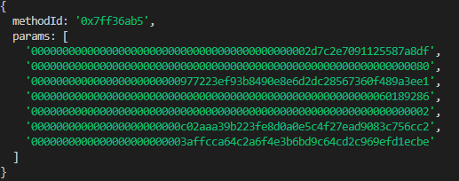
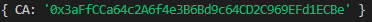

# Evm-Input-Data-Decoder

This npm package helps decode Ethereum transaction input data you get when making a call to etherscan or another evm scanner api with a similar URL to this:
[wallet address transactions](https://api.etherscan.io/api?module=account&action=txlist&address=0x977223Ef93b8490E8E6d2dC28567360F489A3EE1&startblock=0&endblock=99999999&sort=asc&apikey=YourApiKeyToken). If you look closely at the data, you will see that the transactions that interact with contract addresses have an encoded input field. This package helps decode that input field and extract the method id and parameters. It also identifies and extracts the token contract address from well-known function signatures. The library uses Web3.js under the hood, allowing users to interpret the ABI-encoded data to make sense of contract interactions.


## Features

- Decode Input: Extracts method id and parameters from input string from an EVM transaction.
- Console log Decode Input: console logs extracted method id and parameters.
- Get Contract Address: Identifies and extracts the token contract address from a variety of well-known function signatures including (
    - swapETHForExactTokens(uint256 amountOut, address[] path, address to, uint256 deadline),
    - swapTokensForExactTokens(uint256 amountOut, uint256 amountInMax, address[] path, address to, uint256 deadline),
    - swapExactETHForTokens(uint256 amountOutMin, address[] path, address to, uint256 deadline),
    - swapExactTokensForTokens(uint256 amountIn, uint256 amountOutMin, address[] path, address to, uint256 deadline),
    - swapExactTokensForETH(uint256 amountIn, uint256 amountOutMin, address[] path, address to, uint256 deadline),
    - swap(string aggregatorId, address tokenFrom, uint256 amount, bytes data), 
    - swapExactTokensForTokensSupportingFeeOnTransferTokens(uint256 amountIn, uint256 amountOutMin, address[] path, address to, uint256 deadline),
    - swapExactTokensForETHSupportingFeeOnTransferTokens(uint256 amountIn, uint256 amountOutMin, address[] path, address to, uint256 deadline),
    - swapExactTempleForStable(uint256 amountIn, uint256 amountOutMin, address stable, address to, uint256 deadline)).
- Console log Contract Address: console logs extracted contract address.


## Installation

Install evm-input-data-decoder with npm

```bash
  npm install evm-input-data-decoder --save
```

## Usage/Examples

```javascript
//IMPORT METHOD
const decoder = require('evm-input-data-decoder');

//example input data you want to decode
const input = "0x7ff36ab5000000000000000000000000000000000000000000002d7c2e7091125587a8df0000000000000000000000000000000000000000000000000000000000000080000000000000000000000000977223ef93b8490e8e6d2dc28567360f489a3ee100000000000000000000000000000000000000000000000000000000601892860000000000000000000000000000000000000000000000000000000000000002000000000000000000000000c02aaa39b223fe8d0a0e5c4f27ead9083c756cc20000000000000000000000003affcca64c2a6f4e3b6bd9c64cd2c969efd1ecbe" // Example input from a transaction 


// Console Log Decoded Input Data
decoder.consoleLogDecodedInput(input)

// Console Log Contract Address
decoder.consoleLogGetContractAddress(input)

//decodes the transaction input data
decoder.decodeInput(input)
//returns an object of methodId String and input parameters Array

//gets the contract address
decoder.getContractAddress(input)
//returns CA: Contract Address
```
```javascript
//DESTRUCTURING METHOD
// Import the necessary functions or features from the package
const { decodeInput, getContractAddress,consoleLogDecodedInput,consoleLogGetContractAddress } = require('evm-input-data-decoder');

//example input data you want to decode
const input = "0x7ff36ab5000000000000000000000000000000000000000000002d7c2e7091125587a8df0000000000000000000000000000000000000000000000000000000000000080000000000000000000000000977223ef93b8490e8e6d2dc28567360f489a3ee100000000000000000000000000000000000000000000000000000000601892860000000000000000000000000000000000000000000000000000000000000002000000000000000000000000c02aaa39b223fe8d0a0e5c4f27ead9083c756cc20000000000000000000000003affcca64c2a6f4e3b6bd9c64cd2c969efd1ecbe" // Example input from a transaction 


// Console Logs Decoded Input Data
consoleLogDecodedInput(input)

// Console Logs Contract Address Data
consoleLogGetContractAddress(input)

//decodes the transaction input data
decodeInput(input)
//returns an object of methodId String and input parameters Array

//gets the contract address
getContractAddress(input)
//returns CA: Contract Address

```






## Appendix

This section provides a detailed breakdown of the main functions and utility functions available in the package.

#### `decodeInput(input)`
Purpose:

To decode Ethereum transaction input data.

Parameters:

input_data (String): The ABI encoded input data from a transaction.

Returns:

An object containing:
methodId: A string representing the first 10 characters of the input data which usually represents the function signature.

params: An array containing parameters that have been extracted from the input data.

#### `getContractAddress(input)`
Purpose:

To identify and extract the token contract address from well-known function signatures within the provided ABI encoded data. 

Parameters:

input_data (String): The ABI encoded input data from a transaction.

Returns:

One of the following:
An object with a single key, "CA", that maps to the token contract address in the format "0x...token address...".

An error message stating the inability of the dependency to find the token contract address in the given input data.

### Utility Functions:
#### `consoleLogDecodedInput()`
Purpose:

To decode the ABI encoded input data and print the results to the console.

Usage:

Call the function directly without any parameters to see the decoded input printed to the console.
#### `consoleLogGetContractAddress()`
Purpose:

To decode the ABI encoded input data to identify and extract the token contract address and then print either the address or an error message to the console.

Usage:

Call the function directly without any parameters to see the extracted token contract address or the relevant error message printed to the console.

## Contributors

- [Vadim Race](https://github.com/Git-Vdim-Hub)
- [Mofazzel Hossen](https://github.com/moofazzel)
- [Nowrin Islam Mim](https://github.com/BubbleNowrin)

## License

[MIT](https://choosealicense.com/licenses/mit/)


## Disclaimer

Please make sure to test this library extensively before using it in a production environment. Ensure the decoded data and extracted addresses align with your expectations.